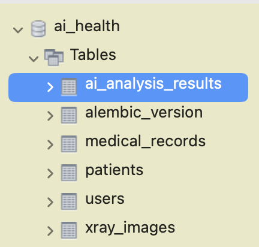
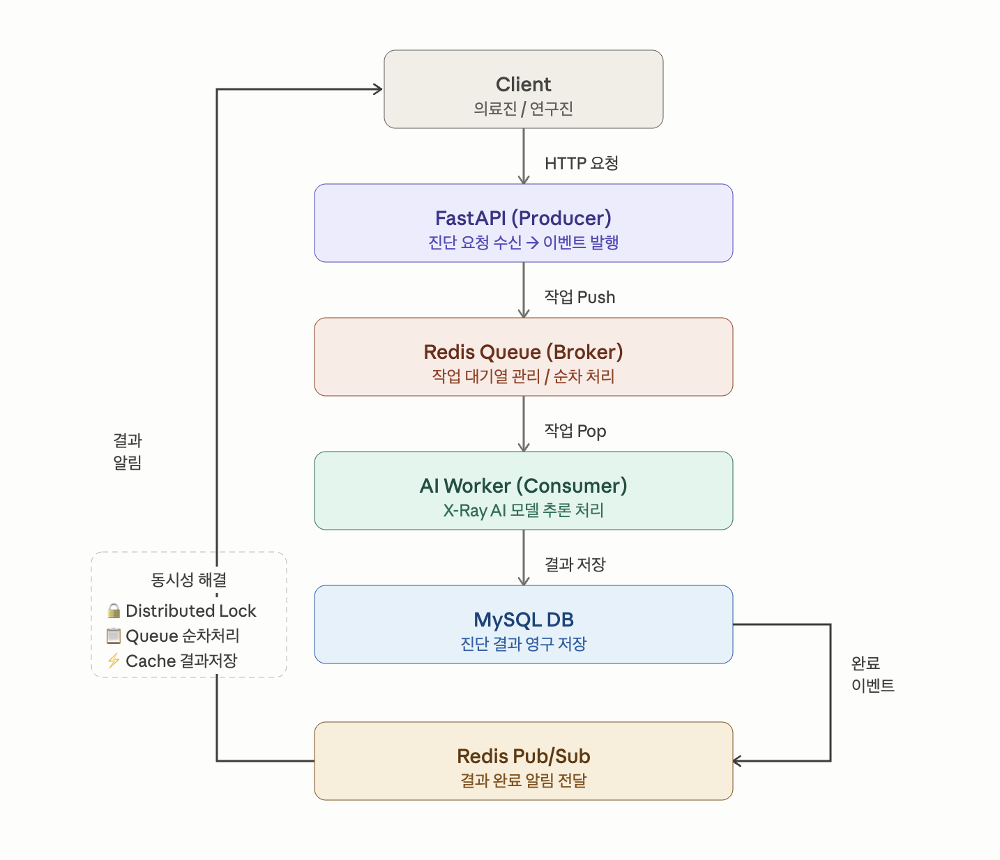
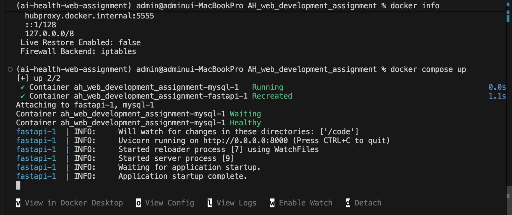
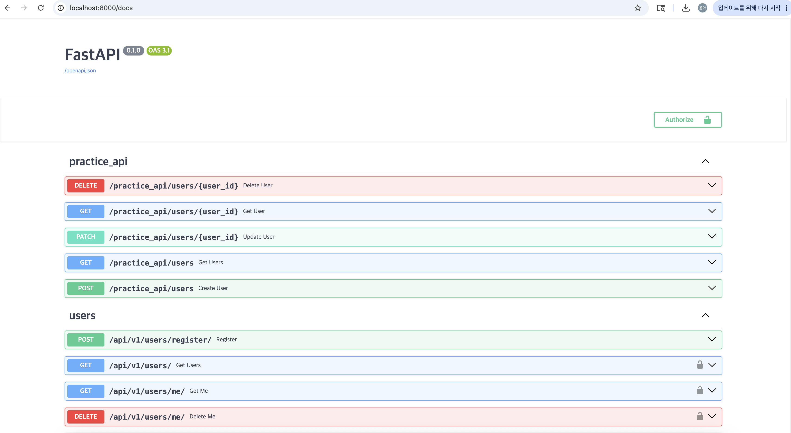
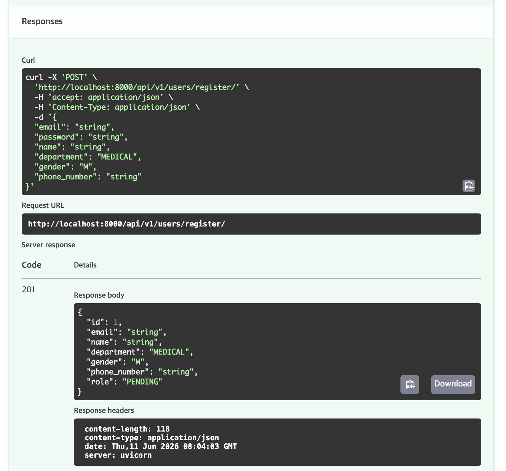

# AI Health Web Assignment

## 프로젝트 개요

본 프로젝트는 흉부 X-Ray 폐렴 판독 모델을 활용한 폐렴 환자 관리 백오피스 웹 서비스입니다.

FastAPI를 기반으로 사용자, 환자, 진료기록 및 폐렴 예측 관련 API를 구현하였으며, Redis와 AI Worker를 이용해 폐렴 예측 작업을 비동기적으로 처리하도록 구성하였습니다.

프로젝트는 팀원별 역할을 고정적으로 구분하기보다 단계별 과제를 함께 검토하고, 기능을 분담하여 구현한 뒤 Pull Request를 통해 `main` 브랜치에 병합하는 방식으로 진행하였습니다.

## 프로젝트 진행 과정

### 1. Team Rule 정의

프로젝트를 시작하기 전에 팀원 간 협업 방식과 Git 사용 규칙을 정하였습니다.

팀원들은 정해진 프로젝트 작업 시간에 참여하고, Slack을 통해 작업 내용과 진행 상황을 공유하였습니다. 의견 충돌이 발생한 경우 팀원 간 논의를 통해 해결하고, 해결되지 않는 경우 다수결로 결정하였습니다.

Git 작업은 기능별 브랜치를 생성한 뒤 커밋과 Push를 진행하고, Pull Request와 코드 확인 과정을 거쳐 `main` 브랜치에 병합하는 방식으로 진행하였습니다.

https://app.notion.com/p/OZ_API_4-372324ffe2f480928deae34b4e0a829c?showMoveTo=true&saveParent=true

### 2. 사용자 요구사항 정의

구현 전에 서비스에서 필요한 기능과 사용자의 요구사항을 정의하였습니다.

주요 요구사항은 사용자 관리, 환자 관리, 진료기록 관리, 흉부 X-Ray 이미지 업로드 및 폐렴 예측 결과 조회 기능입니다.

사용자는 회원 정보를 등록하고 조회·수정·삭제할 수 있으며, 환자와 진료기록을 관리할 수 있습니다. X-Ray 이미지가 등록되면 AI 모델을 이용해 폐렴 여부를 예측하고 결과를 저장할 수 있도록 설계하였습니다.

### 3. API 명세서 작성

기능 구현 전에 각 API의 HTTP Method, URL, 요청 데이터, 응답 데이터와 오류 응답을 정리하였습니다.

작성한 주요 API 명세는 다음과 같습니다.

* [User API 설계](docs/4일차_USER_API_설계.md)
* [환자 관리 및 진료기록 API 설계](docs/5일차_환자관리_API_설계.md)
* [폐렴 예측 API 설계](docs/6일차_폐렴예측_API_설계.md)

API 명세를 기준으로 FastAPI Router, Schema, Service 및 Repository 코드를 작성하였습니다.

### 4. Git & GitHub Branch 전략 구성

본 프로젝트는 단기간에 여러 기능을 병렬로 개발하기 위해 GitHub Flow 전략을 사용하였습니다.

`main` 브랜치는 병합이 완료된 코드를 관리하고, 새로운 기능은 `feature/기능명` 형태의 브랜치에서 작업하였습니다.

작업 과정은 다음과 같습니다.

```text
main 브랜치 최신화
→ feature 브랜치 생성
→ 기능 구현
→ Commit 및 Push
→ Pull Request 생성
→ 코드 확인
→ main 브랜치 Merge
```

커밋 메시지는 `feat`, `fix`, `docs`, `build`, `test`, `refactor` 등의 접두사를 사용하여 변경 목적을 구분하였습니다.

상세 내용은 다음 문서에서 확인할 수 있습니다.

[Git 브랜치 전략](docs/2일차_git_branch_전략_최종.md)

### 5. 프로젝트 세팅

FastAPI 프로젝트의 역할을 구분하기 위해 다음과 같이 디렉터리를 구성하였습니다.

```text
app/
├── apis/           API 엔드포인트
├── core/           환경설정, DB 및 Redis 연결
├── models/         SQLAlchemy 데이터베이스 모델
├── repositories/   데이터베이스 접근 로직
├── schemas/        요청 및 응답 데이터 검증
├── services/       비즈니스 로직
└── main.py         FastAPI 애플리케이션 실행 파일

worker/
├── models/         AI 모델 파일
├── redis_client.py Redis 연결
└── main.py         AI 예측 작업 실행
```

SQLAlchemy ORM을 이용해 데이터베이스 모델을 작성하고, Alembic을 이용해 데이터베이스 스키마를 관리하였습니다.

프로젝트 구조와 데이터베이스 설정에 관한 내용은 다음 문서에서 확인할 수 있습니다.

* [프로젝트 구조 분석](docs/3일차_프로젝트_뜯어보기.md)
* [DB 모델 및 마이그레이션](docs/3일차_db_migration.md)

데이터베이스에 적용된 주요 테이블은 다음과 같습니다.

```text
users
patients
medical_records
xray_images
ai_analysis_results
```



### 6. API 및 AI Worker 코드 작성 후 Branch 전략을 통한 코드 병합

작성한 API 명세를 기준으로 사용자, 환자, 진료기록 및 폐렴 예측 API를 구현하였습니다.

주요 구현 기능은 다음과 같습니다.

* 사용자 정보 등록, 조회, 수정 및 삭제
* 환자 정보 등록, 조회, 수정 및 삭제
* 진료기록 등록, 조회, 수정 및 삭제
* 흉부 X-Ray 이미지 업로드
* AI 모델을 이용한 폐렴 예측
* 폐렴 예측 결과 저장 및 조회

각 기능은 별도의 브랜치에서 작성한 뒤 Pull Request를 통해 `main` 브랜치에 병합하였습니다.

AI 예측 작업은 FastAPI 애플리케이션과 AI Worker를 분리하여 실행하도록 구현하였습니다. FastAPI가 Redis 작업 대기열에 예측 요청을 등록하면 AI Worker가 요청을 가져와 모델 예측을 수행하고, 결과를 다시 Redis를 통해 전달하도록 구성하였습니다.

### 7. 아키텍처 설계 및 적용

AI 모델 예측에는 비교적 긴 처리 시간이 필요하므로, FastAPI 요청 처리와 AI 모델 실행을 분리하는 Event-Driven Architecture를 적용하였습니다.

전체 처리 흐름은 다음과 같습니다.

```text
Client
→ FastAPI
→ Redis Task Queue
→ AI Worker
→ AI Model Prediction
→ Redis Pub/Sub
→ FastAPI
→ Database
→ Client Response
```

FastAPI는 사용자의 요청을 받은 뒤 Redis 작업 대기열에 작업을 등록합니다. AI Worker는 대기열에서 작업을 가져와 폐렴 예측을 수행하고 결과를 Redis로 전달합니다. FastAPI는 전달받은 결과를 데이터베이스에 저장한 뒤 사용자에게 응답합니다.



상세 내용은 다음 문서에서 확인할 수 있습니다.

[동시성 문제 해결을 위한 아키텍처 설계](docs/9일차_동시성문제_해결을위한_아키텍처설계.md)

### 8. Docker 인프라 관련 파일 작성

개발 환경을 일관되게 실행하기 위해 Docker 기반 실행 환경을 구성하였습니다.

주요 Docker 구성 파일은 다음과 같습니다.

```text
app/Dockerfile
app/.dockerignore
worker/Dockerfile
docker-compose.yml
```

Docker Compose를 통해 FastAPI, 데이터베이스, Redis 및 AI Worker 서비스를 함께 실행할 수 있도록 구성하였습니다.

```bash
docker compose up --build
```

백그라운드에서 실행하려면 다음 명령어를 사용합니다.

```bash
docker compose up -d --build
```

실행 중인 컨테이너는 다음 명령어로 확인할 수 있습니다.

```bash
docker compose ps
```







### 9. AWS 배포

이번 프로젝트에서는 Docker Compose를 이용한 로컬 실행 환경까지 구성하였습니다.

AWS를 이용한 외부 서버 배포는 진행하지 않았습니다. 향후 AWS EC2 등의 서버 환경에 Docker 기반 서비스를 배포할 수 있도록 실행 구조를 구성하였습니다.

### 10. QA 진행

Swagger UI와 Docker 실행 환경에서 주요 API가 정상적으로 실행되는지 수동 테스트를 진행하였습니다.

확인한 항목은 FastAPI 애플리케이션 실행 여부, Swagger UI 접근 여부, 주요 API 요청 및 응답 여부, Docker 컨테이너 간 연결 상태입니다.

프런트엔드 화면과 API 연결 결과는 다음 문서에서 확인할 수 있습니다.

[앱 실행 화면](docs/7일차_앱_실행화면.md)

자동화 테스트와 전체 예외 상황에 대한 테스트는 별도로 구현하지 않았으며, 현재 QA는 Swagger UI와 실제 화면을 이용한 수동 기능 확인을 중심으로 진행하였습니다.

## Alembic Migration Guide

모델이 변경된 경우 다음 명령어를 실행하여 마이그레이션 파일을 생성합니다.

```bash
uv run alembic revision --autogenerate -m "변경 내용 설명"
```

생성된 마이그레이션을 데이터베이스에 적용합니다.

```bash
uv run alembic upgrade head
```

마지막 마이그레이션을 이전 상태로 되돌립니다.

```bash
uv run alembic downgrade -1
```

## 프로젝트 결과

본 프로젝트에서는 GitHub Flow를 기반으로 팀 협업과 코드 병합 과정을 수행하였습니다. FastAPI를 이용한 백엔드 API, SQLAlchemy와 Alembic을 이용한 데이터베이스 관리, Redis 기반 비동기 작업 처리, AI Worker 분리 및 Docker Compose 실행 환경을 구성하였습니다.

AWS 배포는 수행하지 않았으며, Docker 기반 로컬 실행과 Swagger UI를 이용한 주요 기능 검증까지 완료하였습니다.
